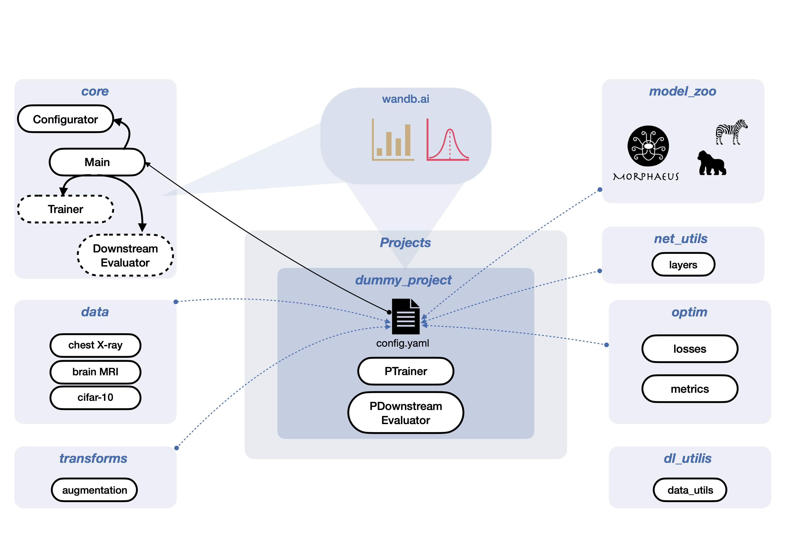

# On Differentially Private 3D Medical Image Synthesis with Controllable Latent Diffusion Models 
## Data
This project assumes the UK Biobank images are pre-processed and organized as follows:

### Data Folder Structure

The data folder `path/to/data/folder` is expected to contain three `.npy` files:

- `training.npy`
- `validation.npy`
- `testing.npy`

Each of these `.npy` files contains rows of string paths that point to individual sample files. The sample files are expected to be located in subfolders, for example, `./data`.

### Sample File Structure

The individual sample files must be loadable by NumPy and contain:

1. `image`
2. `labels`

#### Image Object

- **Type**: NumPy array
- **Shape**: (D, H, W)
- **Shape Used in This Study**: (13, 96, 96)

#### Labels Object

- **Type**: 1D NumPy array
- **Label Order**: As specified in the configuration YAML files


## Training

Models can be configured using the configuration YAML files located in the `projects` directory. Latent Diffusion Models (LDMs) can be trained either directly in image space or using an image-to-latent compression model. This project supports two compression models for this purpose:

1. **β-VAE**
2. **VQ-VAE**

### Compression Model Training

Before training the LDM, the chosen compression model (β-VAE or VQ-VAE) must be trained. The path to the trained compression model are then specified in the LDM configuration.

### Training Resources

- For training with 4x compression, two A100 GPUs were used.
- For differentially private models, more resources are required to increase the batch size. It is recommended to use four A100 GPUs or eight V100 GPUs to handle larger batch sizes and complete the training within one day.

### Note

- The requirements include a proprietary Opacus fork to ensure compatibility with the other packages.

## Evaluation

We utilized the [ukbb_cardiac](https://github.com/baiwenjia/ukbb_cardiac) package, which provides implementations for TensorFlow-based image segmentation and segmentation evaluation, such as calculating myocardial wall thickness. These evaluation functions were executed by launching external scripts.


# IML-CompAI DL

Overview Deep Learning Framework




# Installation guide: 

0). Set up wandb. (https://docs.wandb.ai/quickstart)
 *  Sign up for a free account at https://wandb.ai/site and then login to your wandb account.
 * Login to wandb with `wandb login`
 * Paste the API key when prompted. You will find your API key here: https://wandb.ai/authorize. 
 
1). Clone iml-dl to desired location 
 * `git clone https://github.com/iml-compai-munich/iml-dl.git *TARGET_DIR*`

2). Create a virtual environment with the needed packages (use conda_environment-osx.yaml for macOS)
```
cd ${TARGET_DIR}/iml-dl
conda env create -f conda_environment.yaml
source activate iml_py308 *or* conda activate iml_py308
```

3). Install pytorch
* *with cuda*: 
```
pip3 install torch==1.9.1+cu111 torchvision==0.10.1+cu111 -f https://download.pytorch.org/whl/torch_stable.html
```
* *w/o cuda*:
```
pip3 install torch==1.9.1 torchvision==0.10.1 -f https://download.pytorch.org/whl/torch_stable.html
```

4). Run the demo script: 
```
python core/Main.py --config_path projects/dummy_project/config_cifar10.yaml
```


5). _Optional_: Clone the projects folder to your own Github:

```
cd ${TARGET_DIR}/iml-dl/projects
git init
git remote add origin $URL_TO_YOUR_REPO
git branch -M main
git commit -m "first commit"
git push -u origin main
```
# Push policy 
Please create a new branch for your project. Desired changes to the framework can be done on a push-request and code peer-review basis. 

# That's it, enjoy! :rocket:
